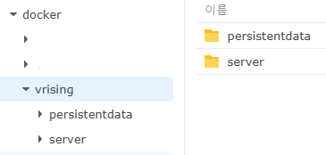
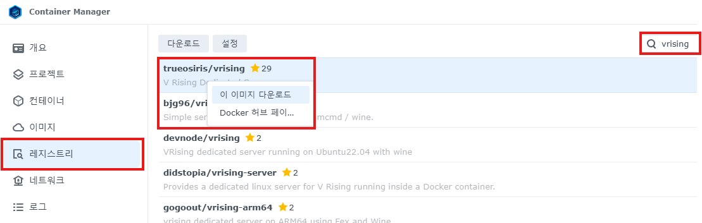
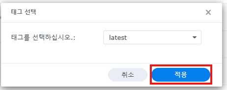
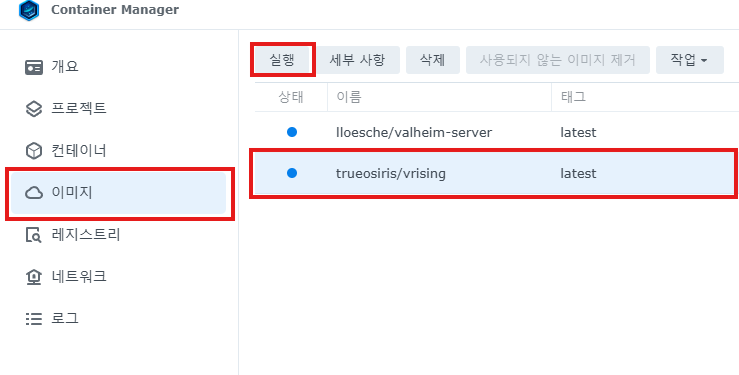
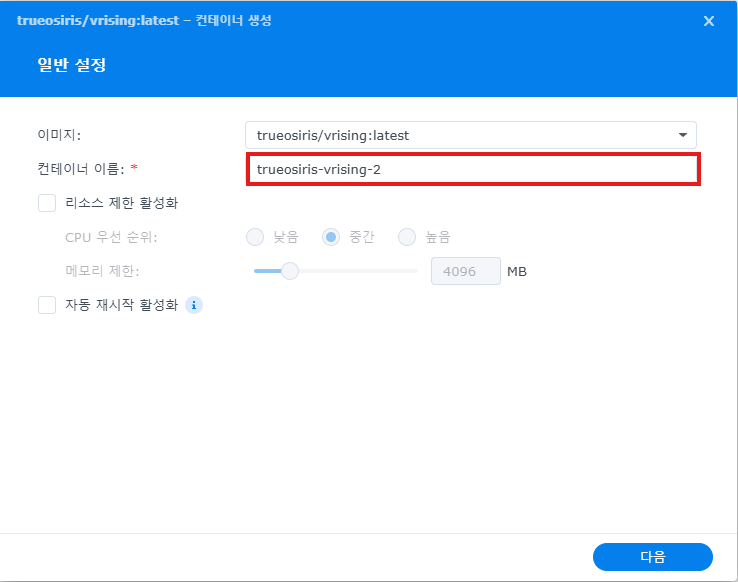
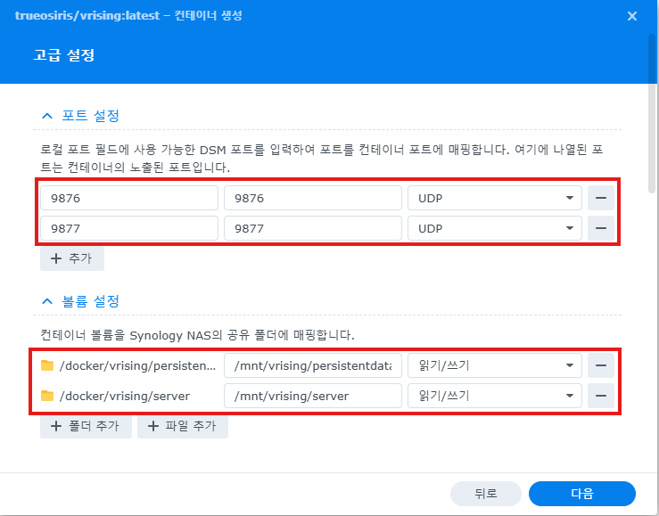
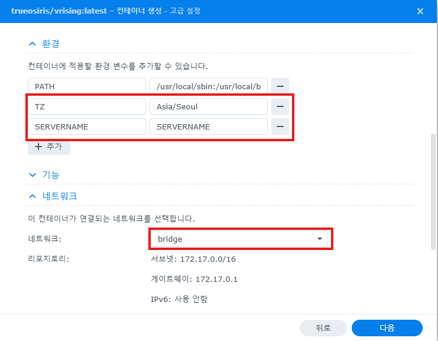
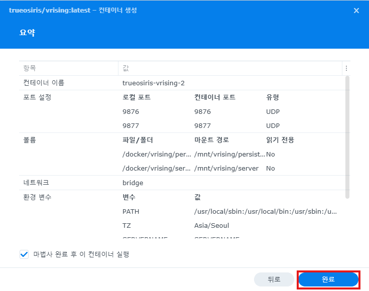

# V Rising
------
## Synology Container
### 1. 폴더 생성
- docker 폴더 밑에 vrising/data, vrising/server 폴더를 생성한다. 해당 폴더들은 컨테이너에 마운트하기 위한 폴더이기 때문에 미리 생성해둔다. 

### 2. 컨테이너 설정 프로세스

#### 2.1 이미지 다운로드 

- 레지스트리를 선택하여 이미지를 다운로드 한다. 여기선 제일 인기가 많은 trueosiris의 vrising 이미지를 선택했다. 컨테이너 매니저의 별표 수는 실제 도커 이미지의 수와 다르게 컨테이너 매니저 내의 인기 별표만 나타내는 것 같아 보인다. 실제 도커 허브를 들어가서 살펴보면 별의 개수가 상이한 것을 확인할 수 있다.

- 이미지를 다운로드 할 때는 latest 설정으로 진행한다. 이미지의 버전을 임의로 저장해두면 나중에 서버가 업데이트 됐을때 다시 설정해줘야하는 불상사가 발생할 수 있다.

#### 2.2 컨테이너 띄우기 

- 레지스트리에서 다운로드가 완료되었으면 이미지로 넘어가서 컨테이너를 실행시킨다.

- 일반 설정은 컨테이너 이름만 임의로 정하고 진행한다. 이미지에선 스크린샷을 찍기 위해 재진행이라 -2로 찍혔다.

- 포트 설정은 기본적으로 9876과 9877을 오픈해준다. 브이라이징의 서버는 UDP를 사용하고 있다. 사전에 만들어둔 폴더들 또한 마운트해준다. 기본적으로 좌측의 도커의 폴더가, 컨테이너의 해당 폴더와 동일하다고 보면 된다.
  - /mnt/vrising/persistentdata
  - /mnt/vrising/server

- trueosiris가 만들어둔 환경변수는 아래 두개만 설정하면 되며, 나머지는 그 아래 ServerHostSetting 및 ServerGameSetting에서 컨트롤해주면 된다. 
  - TZ : 타임존, 한글로 적혀있는 이 문서를 읽고있는 분들은 Asia/Seoul로 보통 작성하면 될 것이다.
  - SERVERNAME : 원하는 서버명을 작성하면 된다

- 아래 네트워크는 bridge 와 host를 둘다 선택해도 되지만, 기본적으로 bridge를 가정하고 진행하였다. 

- 완료.

### Network 설정
#### Static IP
Nas가 재부팅될 때 변동하는 IP라면 기존의 서버 IP도 변경되어 유저들이 불편을 겪게 된다. 이를 방지하기 위하여 고정 IP 세팅을 해주어야 한다. 만약 한번도 Nas를 끄지 않을 자신이 있다면 스킵해도 된다. 
##### DHCP Server
공유기에서 나스를 선택하고 원하는 IP주소와 MAC 주소를 입력해주면 된다.
##### Synology setting

#### Port Forwarding

## Game Setting
경로 : vrising/persistentdata/Settings
아래 파일을 편집하기 위해서는 컨테이너를 중지 후에 편집하길 권장한다. 
### adminlist.txt
- Steam64 ID를 삽입하여 어드민 권한 부여
### banlist.txt
- Steam64 ID를 삽입하여 서버 접근 금지

### ServerHostSettings.json 
- 네트워크 관련 환경 설정을 하는 파일
- Name : "",   
- Description : "",
- MaxConnectedUsers: 10,
- MaxConnectedAdmins: 1,
- SaveName : "",
- Password : "0123456789",
  - 제일 중요한 암호 설정하는 파라미터, 문자열로 넣어주면 된다.
### ServerGameSettings.json
- GameDifficulty : 0-캐주얼, 1-일반, 2-잔인

그 외 설정들은 [링크](https://gall.dcinside.com/mgallery/board/view/?id=vrising&no=5863)에서 원하는 값으로 찾아보고 바꿔주면 된다.

## Reference
- https://gall.dcinside.com/mgallery/board/view/?id=vrising&no=7221
- https://techtim.tistory.com/50
- https://svrforum.com/nas/1607783

- https://m.blog.naver.com/boshow/222292538297
- https://blog.naver.com/techbor/222883504298
이미지 임시
- https://velog.io/@hotmosit/Markdown-%EC%9D%B4%EB%AF%B8%EC%A7%80-%EC%B2%A8%EB%B6%80-%EB%B0%8F-%EC%A1%B0%EC%A0%95